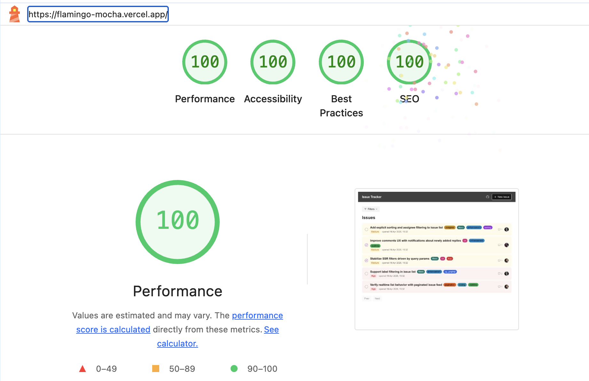

This project was built as part of the Flamingo Frontend Engineer take-home assignment and follows the specification described in [speka.md](./speka.md).

## Getting Started
To run this project, complete the following steps in order:

1. Clone the repository and install dependencies.
2. Set up the database.
3. Configure the database connection.
4. Generate GraphQL and Relay types.
5. Start the development server

### 1. Clone the repository and install dependencies:

```bash
git clone https://github.com/DVitaliy/flamingo.git
cd flamingo
pnpm install
```

### 2. Set up the database

This project uses Supabase Postgres together with the `pg_graphql` extension. The database requirements for this project are defined in the specification. See [speka.md](./speka.md) for the expected schema and related data model details.

- Create a new Supabase project in the dashboard.

- Apply the base schema

  Run the SQL from `supabase/schema.sql` in the Supabase SQL editor.

  This script:

  - enables `pgcrypto`
  - enables `pg_graphql`
  - creates the Postgres enums `issue_status` and `issue_priority`
  - creates the tables `users`, `issues`, `comments`, `labels`, and `issue_labels`
  - creates the indexes used by the app
  - enables `totalCount` and `aggregate` support for `comments` in `pg_graphql`
  - includes the SQL for adding `public.issues` to the Supabase realtime publication

  > In some environments, the realtime publication step may need to be run manually:

  ```sql
  alter publication supabase_realtime add table public.issues;
  ```

- Apply seed data, run `supabase/seed.sql` after the base schema.

### 3. Configure the database connection.

Create `.env.local` from `.env.example` and fill in:

- `NEXT_PUBLIC_SUPABASE_URL`
- `NEXT_PUBLIC_SUPABASE_GRAPHQL_URL`
- `NEXT_PUBLIC_SUPABASE_ANON_KEY`

Where to get them:

* NEXT_PUBLIC_SUPABASE_URL
    > In Supabase Studio, open your project and copy the Project URL from the Connect dialog, or from __Settings → API__.  
* NEXT_PUBLIC_SUPABASE_ANON_KEY
    > For client-side usage, copy the project’s anon key from __Settings → API → Project API keys__. Supabase also notes that the newer publishable key is the preferred replacement for the older anon key, but both are available during the transition period.  
* NEXT_PUBLIC_SUPABASE_GRAPHQL_URL
    > Build it from your project reference using this format:
    > __https://<PROJECT_REF>.supabase.co/graphql/v1__
    > Supabase documents this as the project GraphQL endpoint and notes that it must not have a trailing slash. You can find the project reference in __Settings → General → Project Settings → Reference ID__.

### 4. Generate GraphQL and Relay types

Then make sure the database is initialized and the local GraphQL/Relay artifacts are generated:

```bash
pnpm schema:sync
pnpm dev
```

`pnpm schema:sync` is required before the first local run, and again whenever the database schema changes.

This project does not store generated Relay artifacts or the reflected GraphQL schema in Git. The following files are generated locally when needed:

- `schema.graphql`
- `__generated__/`

### 5. Start the development server

```bash
pnpm dev
```

Open [http://localhost:3000](http://localhost:3000) with your browser to see the result.


## Spec Compliance Checklist

Legend:
- `[done]` completed
- `[partial]` partially completed
- `[missing]` not completed
- `[unverified]` cannot be verified from the repository alone

For every `[missing]` and `[partial]` item below, a short explanation is provided directly underneath.

### Tech Stack
- `[done]` Next.js 14+ with App Router
- `[done]` Relay + Supabase GraphQL (`pg_graphql`)
- `[done]` TypeScript in strict mode
- `[done]` Tailwind CSS
- `[done]` Zod validation

### Backend / Database
- `[done]` Supabase is used as the backend
- `[done]` `pg_graphql` is enabled in the database setup
- `[done]` Required tables exist: `users`, `issues`, `comments`, `labels`, `issue_labels`
- `[done]` Required relationships exist
- `[done]` Schema is extended, but the required tables and relationships are preserved

### Issue List
- `[done]` Filter by status
- `[done]` Filter by priority
- `[missing]` Filter by labels
  Label filter UI exists, but label query params are not applied to the server-side issue list query.
- `[partial]` Multi-select filters
  Multi-select works for status and priority. Label multi-select is present in the UI, but does not affect the list results.
- `[done]` Cursor-based pagination using Relay connection spec
- `[done]` Optimistic update on status change
  Status changes now update immediately in the UI and are reconciled with the server result.
- `[done]` Graceful reconciliation on status update failure
  If the mutation fails, the optimistic status is rolled back to the previous value and visible feedback is shown to the user.
- `[done]` Failure feedback for status update, e.g. toast
  Status update failures now show visible inline feedback instead of failing silently.

### Issue Detail
- `[done]` Edit title
- `[done]` Edit description
- `[done]` Edit status
- `[done]` Edit priority
- `[done]` Edit assignee
- `[done]` Edit labels
- `[done]` Comment thread exists
- `[done]` Comment thread uses cursor-based pagination
- `[partial]` Each detail-page section uses a co-located Relay fragment
  Comments use Relay fragments and pagination, but the rest of the detail page still relies on a larger page-level query.
- `[missing]` No monolithic top-level query for the detail page
  The detail page still uses a monolithic issue query for most sections.

### Real-Time
- `[done]` Issue list reflects changes from other users without a manual browser refresh
- `[done]` Supabase Realtime is used for list updates

### Relay Compiler + pg_graphql
- `[done]` Relay compiler is configured to work with `pg_graphql` conventions
- `[done]` README explains how Relay + `pg_graphql` were made to work together
- `[done]` README explains the main problems encountered in that integration

### README
- `[done]` Setup instructions: clone
- `[done]` Setup instructions: install
- `[done]` Setup instructions: configure Supabase
- `[done]` Setup instructions: run
- `[done]` Relay + `pg_graphql` configuration is documented
- `[done]` Architecture decisions are documented
- `[done]` Trade-offs are documented
- `[done]` Incomplete areas are explicitly described, including what would be done with more time

### Submission
- `[done]` Private GitHub repo
- `[unverified]` Access granted to Oleksandra
- `[done]` Deployed on Vercel

## Label filtering trade-off

The take-home requires multi-select filtering by labels. In the current implementation, I intentionally did **not** ship label filtering on top of the generated `pg_graphql` schema, because the reflected GraphQL schema exposed the `issue_labelsCollection` relationship for reading, but did **not** expose a relation-based filter on `issuesFilter` for filtering `issuesCollection` by the many-to-many labels link.

In practice, this meant:

- reading labels through the relationship worked
- filtering issues by `status` and `priority` worked directly through `issuesFilter`
- filtering issues by labels through the same root `issuesCollection(filter: ...)` API was not available in the generated schema shape

I decided not to force a brittle workaround, such as querying through `issue_labelsCollection` and reconstructing issues on the client, because that would introduce duplication, unstable pagination behavior, and a less clear data flow for the list page.

### What I would do with more time

If this approach were confirmed as acceptable within the assignment constraints, I would introduce a small read-optimized denormalization for labels.

Concretely, I would:

1. add a derived field on `issues`, for example `label_names text[]`
2. backfill existing values from `issue_labels` + `labels`
3. add a trigger so that whenever issue-label relationships change, the derived label array on `issues` is updated automatically
4. filter the issue list through that field instead of relying on a many-to-many relation filter generated by `pg_graphql`

This would preserve:

- the normalized write model:
  - `labels`
  - `issue_labels`
- while also providing a read model that is much easier to filter through the reflected GraphQL schema

I consider this a pragmatic solution for `pg_graphql`-driven applications, where the generated GraphQL API is derived from the database schema and not hand-designed field by field.

## Relay + pg_graphql compatibility

One of the most important parts of this take-home was making Relay work with the GraphQL schema generated by `pg_graphql`.

### Main issue

`pg_graphql` does not expose exactly the same schema conventions that Relay expects out of the box.

The key difference in this project was the global node identifier:

- Relay commonly expects `id` for the `Node` interface identity field
- `pg_graphql` exposes `nodeId` for global object identity

Because of that, Relay compiler/runtime cannot be treated as plug-and-play against the generated Supabase GraphQL schema.

### What I changed

#### 1. Pull the generated GraphQL schema on demand

After enabling `pg_graphql` in Supabase, I configured the project to download the reflected schema into a local `schema.graphql` file when running `pnpm schema:sync`.

That file is generated locally and is intentionally not stored in Git.

This was important because the database schema evolved during the project:
- `status` and `priority` were converted from `text` to Postgres enums
- `comments.totalCount` was enabled through `pg_graphql` table configuration
- GraphQL capabilities changed as the SQL schema changed

Because `pg_graphql` reflects the database schema, the local schema and Relay artifacts need to be re-synced whenever the database structure changes.

#### 2. Configured Relay compiler for `nodeId`

In `relay.config.json` I explicitly configured Relay to use `nodeId` instead of `id`:

- `schemaConfig.nodeInterfaceIdField = "nodeId"`
- `schemaConfig.nodeInterfaceIdVariableName = "nodeId"`

This was required for compatibility with the generated `pg_graphql` Node interface.

#### 3. Configured Relay runtime identity resolution

In the Relay environment, I used `getDataID` to resolve records by `nodeId`.

Without that, Relay store identity would not match the shape of objects returned by `pg_graphql`.

#### 4. Enabled Next.js Relay transform

Running `relay-compiler` alone was not enough.

At first, Relay artifacts were generated successfully, but the app failed at runtime with:

> `graphql: Unexpected invocation at runtime`

The reason was that the Relay GraphQL tagged template was not being transformed during the Next.js build step.

To fix that, I enabled Relay support in `next.config.ts` through the Next compiler configuration. After that, Relay queries were properly compiled and runtime execution worked as expected.

#### 5. Generate Relay artifacts during sync/build

Relay compiler in this setup expects `artifactDirectory` to exist before compilation starts.

To make local setup and deployment reliable, `scripts/pull-schema.mjs` ensures that `__generated__/` exists before `relay-compiler` runs. As a result:

- `pnpm schema:sync` can recreate both `schema.graphql` and `__generated__/` from scratch
- `pnpm build` can do the same automatically in CI or on Vercel
- generated files do not need to be committed to the repository

### Practical architecture decision

I ended up using a hybrid approach:

- Relay compiler and generated artifacts for type-safe GraphQL operations
- SSR pages for the main issue list and issue details shell
- client-side Relay where it is more useful for interactive/paginated sections

This gave me:
- generated and schema-validated types
- a working SSR flow in Next.js App Router
- a path to use Relay where it provides the most value, especially for paginated UI sections

## Detail page trade-off

One important mismatch with the original assignment is that the issue detail page is not yet fully split into section-level Relay fragments.

At the moment:

- the comments section uses Relay fragments and pagination
- the rest of the detail page still relies on a larger page-level query

If I had more time, I would break the detail page into smaller co-located Relay fragments for:

- header
- metadata
- labels
- description
- comments

This was mostly a time trade-off. I had not worked with Relay before this take-home, so I prioritized getting Relay integrated correctly with `pg_graphql`, making pagination work, and implementing fragments first in the comments section where Relay provides the clearest benefit.

I can do the same fragment-based split for the full detail page, but that refactor would need more time to do cleanly.

### What problems came up

The main problems I hit were:

- Relay expecting different Node identity conventions than `pg_graphql`
- the need to re-pull schema after database changes
- generated schema limitations, especially around some relation-based filtering
- build/runtime mismatch before Relay transform was enabled in Next.js

### What I would do with more time

With more time, I would further push the project toward section-level Relay fragments and paginated Relay-driven UI, especially on the issue detail page, so that the implementation more fully reflects the intended fragment-colocation model from the assignment.

## Time allocation

I spent most of my time on implementing and making the core scenarios from the specification work correctly: setting up and connecting the database, integrating `pg_graphql` and Relay, executing queries and mutations, validating data, persisting changes, and covering as many functional cases from the spec as possible. I spent noticeably less time on the internal project structure, including file naming and how files are organized across directories. I spent even less time on visual polish and UI styling, because my main priority was working functionality and alignment with the specification requirements.
